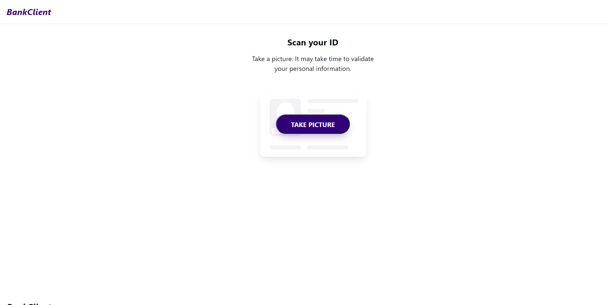

# Z1 tecnic test

Create an app wich verify an ID through web camera and gives you an :+1: or :thumbsdown: whit a validator API.

## Tecnologies

- React
- Typescript
- Sass
- Api-rest
- npm

## Screenshots

